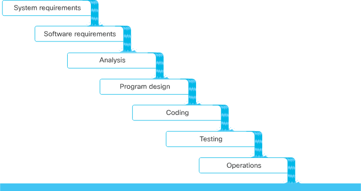

<!-- cSpell:ignore organising -->

# Software Development Methodologies
 
## Waterfall

*  A traditional life cycle, slowly being phased out to newer methodologies
* The lifecycle goes in one direction; down - it can't go back up without completing all he phases again
* Heavy reliance on each phase, therefore if one phase goes wrong it can de-rail the subsequent phases

## Agile

* Considered to be the most popular modern methodology
* Agile manifesto outlines key values
    * Individuals and interactions over processes and tools
    * Working software over comprehensive documentation
    * Customer collaboration over contract negotiation
    * Responding to change over following a plan

* There's a series of principles which allow the manifesto to be met
    1. Customer focus
    2. Embrace change and adapt
    3. Frequent delivery of working software
    4. Collaboration
    5. Motivated teams
    6. Face-to-face conversations
    7. Working software
    8. Work at a sustainable pace
    9. Agile environment
    10. Self-organizing teams
    11. Continuous improvement

* Variations of Agile
    * Agile Scrum
        * Sprints
            * Allows for changes to be made
            * Quick iterations labelled as sprints, to ensure that that the Agile manifesto 'delivery of working software' is met
            * Teams have as many tasks (stories) that they can take within a given time period
            * At the end of a spring, software should be working and deliverable.
                * This doesn't *always* lead to release and software completion, but that is the goal
        * Backlog
            * Product owners are responsible for creating and maintaining a back log.
            * Consist of features which won't be always be in the immediate release.
            * Features can be added here at any time
        * User stories
            * When a task is at the top of a priority list, it enders this list
            * Allows users to request features to provide a certain benefit
            * As a <user|role>, I would like to <action>, so that <value|benefit>
        * Scrum teams
            * Self-managed and self-empowered
            * The entire team is held accountable for the completion of the the user story
            * Scrum teams should be no larger than 10 people in size
            * A standup meeting, everyday is completed, no longer than 15 minutes
                * Keep the team members in sync with what people have achieved since the last standup and what they'll work on between the next standup
        * Consists of small self-organising teams
        * Teams meet daily and work on sprints, which adapt as requirements and deliverables change
        * There is very little engineering specifics associated with Agile Scrum
    * Lean
        * Emphasizes on reducing/removing wasted effort in planning and execution.
    * Extreme Programming (XP)
        * Pretty similar to Scrum, but has more emphasis on software engineering best practices
        * Looks at the more human portions of software development
            * Software engineering overwork, toil, dependency management
            * Consists of 12 core practices which improve productivity
                * Emphasis of end-to-end automation etc
    * Feature-Driven Development (FDD)
        * Defines how software development should proceed
            * Provides a model to reference
    

