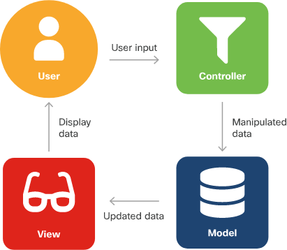
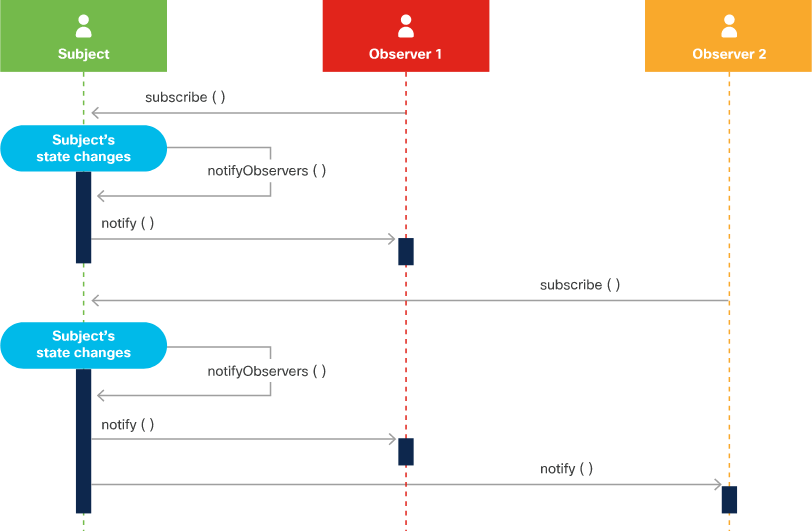

# Software design patterns - MVC & Observer

## Overview

* Trying to solve common problems found throughout various software
* Design patterns should be language-independent
* Program to an interface, not an implementation
    * Logically and loosely couple layers by using abstract interfaces (code calls upon functions in a generic way)
* Favor object composition over class inheritance
    * A generalized base class can be inherited by derived classes

## Design patterns 

### Model-View-Controller (MVC)

* It's goal is to abstract code from the user and rely on GUI's
* Made of 3 components - all components communication with one another in one single direction
    * Model
        * Manages the data, logic and rules
        * Input from controller
    * View
        * Visual representation of the data
    * Controller
        * Middleman between model and view
        * Takes input and manipulates to fit the format of the model or view
        
* MVC execution
    1. User provides input
    2. Controller accepts and manipulates data
    3. Controller send manipulated data to the model
    4. Model accepts data and sends selected data to  the view
    5. View accepts data and displays to user
    6. User is displayed with updated data

* Examples
    * Django - framework built off of MVC for Python
    * Rails - framework built off of MVC for Ruby
    * Spring - framework built off of MVC for Java
    * Backbone.js - framework built off of MVC for Javascript

    
### Observer

* Subscription notification design - objects (observers or subscribers) receives events when changes are made to objects (subject or publisher) they are observing
* Subscription design requirements
    1. Subject must be able to store list of all observers
    2. Subject must have methods to add/remove observers
    3. Observers require a callback to invoke when the publisher sends a notification
* Allows for real time data from subject
    * Always provide better performance than polling etc    

