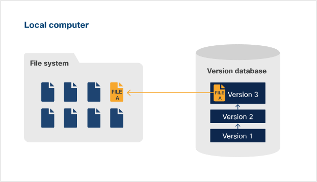
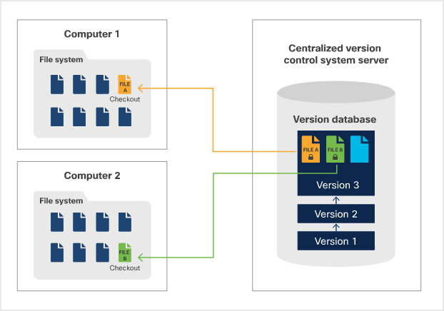
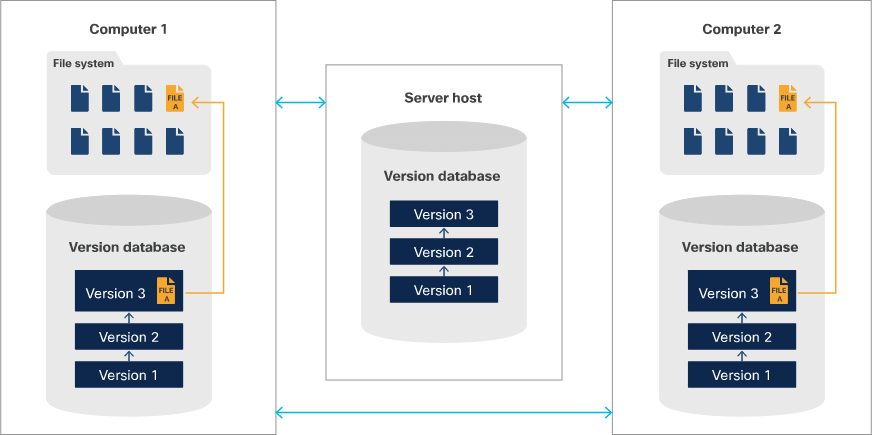
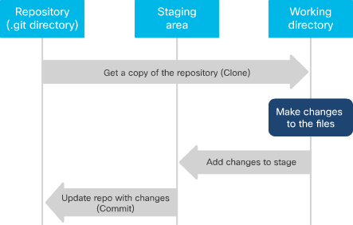
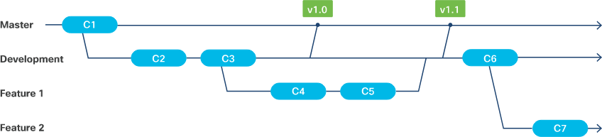

<!-- cSpell:ignore CVCS,DVCS,Gitlab -->

# Version control

* Keeps a master set of files and history of changes to them within the repository (repo)
* To make a change, a user must get a 'working copy' of the repo

* Version control benefits
    * Improved collaboration capabilities
    * Accountability and visibility
    * Isolation for a work environment
    * Safety  with backup and restore
    * Work anywhere

## Types of version control
 * Local
    * Tracks files within a local system
    * Able to revert to a previous version
    * Simple database keeps track of changes
        * Stores delta between two files rather than the file itself
        * When restored, delta is reversed to the requested version

* Centralized (CVCS)
    * Uses server-client model
    * Repo is the only place files are stored (both present and historic)
    * Users needing to make changes, need to get a working copy which they can use on their own system
    * Only a single user can work on a single file at any one given time
        * Users must checkout/in files when they wish to edit a file

* Distributed (DVCS)
    * Peer-to-peer model
    * Can be stored either locally or (usually) on a central repo hosting service
    * The repo must be cloned to a users own machine to make changes
        * Full file set + file history
    * Repo is on multiple systems, protecting against corruption and other data incidents
    * Allows multiple users to work on any file, at any time
    * Once finished making a change, push the file to the repo on the hosting service
        * Hosting services control system detects any history/conflict issues at this stage

## Git

**Head to the [Git section](../1.8-Utilize-common-version-control-operations-with-Git/notes.md) for more information**

* Commands line based software which is flexible, fast and free which provides versioning

### Snapshots

* Git uses snapshots, rather than tracking the delta changes
    * Refers to the new snapshot, instead of taking a new/identical snapshot

### Git Stages

* Repository (.git directory)
    * A project that becomes a Git directory has a hidden .Git directory in it
    * .Git directory holds metadata (compressed) such as commits and logs
* Working directory
    * Working folder which contains a copy of the repo
    * If this gets corrupted, only the client is affected as it's stored locally
* Staging area
    * Stores information on what the user has added/updated/deleted
    * Indexed in the .git directory

### Git States

* Committed
    * The file is stored in the repo (.git directory)
* Modified
    * File is changed, but has not been staged or committed
* Staged
    * Modified file is ready to be committed to the repo

### Repository Locations

* Local
    * The repository itself is stored on a client machine
    * If a repository is cloned, it acts independently to the remote repository until the changed are modified and committed
* Remote
    * The repository itself is stored anywhere but on the client machine, typically a server or hosting service
    * Git/Github can be used for a centralized repository, if required

### Branching

* When codes created, the default branch is called master
* Branching off of master allows users to work independently without affecting the main code of the repo
* Branches can exist either locally or remotely
* Branching can be used to test code implementation - commit if successful, delete branch if it's not
* Branches have their own staging and working directories
* When switching branches, your code in the working directory changes respectively (.git remains unchanged)

* Benefits of branching
    * Work on your own and still use version control
    * Experiment with code
    * Keep production, development and feature code separate
    * Keep main line of code stable

### GitHub

* Independent to Git
* Hosted repository service, provided by Microsoft
* Not the only hosting service for Git (Gitlab & Bitbucket etc)
* 'Pull' repo to make a request to get updated code from repo
