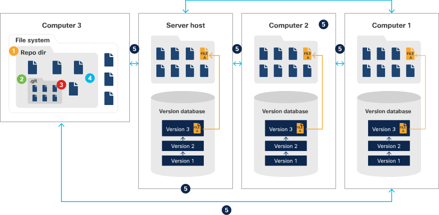
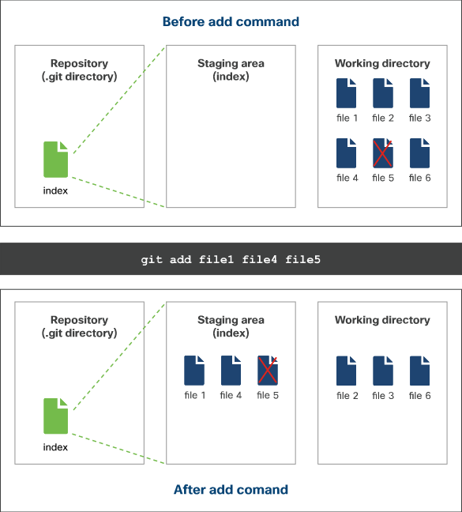
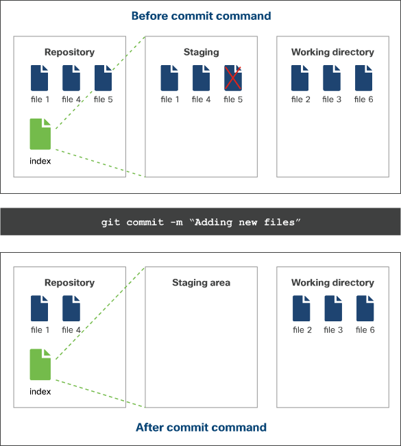

# Using Git

## Setting up Git

* Not matter which operating system you are using, you must configure Git first

```Git
git config --global user.name "<user's name>"
git config --global user.email "<user's email>"
```

## Create the repository

* Any folder and be the repository
* Once a folder is chosen to be a repository, a hidden .git directory folder is created inside

```Git
git init <project directory>
```

## Cloning an existing repository

* If you would like a copy of an existing repository, you can clone it to your local machine
* When cloning, the full repository is cloned including history and branches
* Upon cloning, your own .git directory is created in the new folder
    * It copies the meta data of the repository you have cloned

```Git
git clone <repository> [target directory]
```



## Comparing changes in files

* To check the difference between two files, Git has a feature for that

```Git
git diff <filepath1> <filepath2>
```

## Staging files

* After making changes, the changes must be staged before pushed/committed
* Files which are un-tracked can also be directly added to the staging area

```Git
git add <file path>
```

* To add all of the changed files to staging

```Git
git add .
```



## Removing files in Git

* If you need to remove a file from a Git repository, there's a feature for that

```Git
git rm <file path 1>
```

## Committing changes

* Once you are happy the files in the staging areas are ready to be committed, you can do this via the CLI
* Although you don't have to, it's best practice to add a message when committing files
* If you try to commit files without any files in the staging area, Git will return a message and no changes will be seen

```Git
git commit -m "<message>"
```



## Updating a repository with your changes

* Once changes have been committed a change needs to be pushed to the remote directory
* At this stage, the central repository will check for any conflicts between what's in the local Git repository and the remote repository
    * Conflicts happen if two people make changes to the same file at any given point
    * Conflicts must be resolved before a successful push

```Git
git push origin <branch name>
```

* Once the branch is pushed, it can then be pushed into master.

``Git
git push origin master
```

