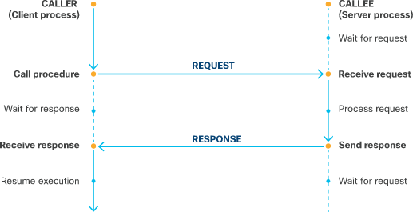

<!-- cSpell:ignore cacheable -->

# Compare Common API Styles

## Synchronous APIs

* Synchronous pace, first come first serve basis

### Synchronous APIs - Benefits

* Typically very fast, if designed correctly.
    * However, this can cause delays in applications if designed incorrectly as he application will need to wait for a response.

### Synchronous APIs - Client-side processing

* Applications must wait for a response before moving onto the next bit of code

## Asynchronous APIs

* Response does not contain any data
* Server process request, sends notification or triggers with the data, after request is processed.
* Usually designed in this type if the data isn't readily available and takes some time to respond
    * If the server has to go to a remote service to fetch data etc
* Even though they are typically slower, responses can be immediate, but just aren't guaranteed like synchronous are.

### Asynchronous APIs - Benefits

* Asynchronous APIs allow the application to continue to execute the code, without having to wait for a response

### Asynchronous APIs - Client-side processing

* Design dependant, but clients can establish a listener and await a callback mechanism for when the notifications are sent back.
    * This may require queuing of data
* Some designs require clients to poll the server for check in on the status of the request

## Remote Procedure Call (RPC)

* Request-response model
* Application (client) makes a procedure call with another application (server)
    * Server is typically located on a different network to the client
* From a clients perspective, the call to the procedure is transparent, simply a method arguments as/when it's called.
* Typically RPC requests are *synchronous*

### Example RPC implementations

* XML-RPC
* JSON-RPC
* NFS 
* Simple Object Access Protocol

## REpresentational State Transfer (REST)

### REST Elements

* Client-Server
* Stateless
    * Server cannot be expected to maintain connection state due to scale
* Cache
    * Server is responsible for marking if the data sent is cacheable or not
    * If data is cached, it can be used later on to stop more requests elsewhere in the code.
* Uniform Interface
* Layered System
* Code-On-Demand

### REST Interface

* REST is built off of some core principles, below are four which the client and server must abide by:-
    * A resource must be identified as an individual object
* Clients can only manipulate data if they have enough data or metadata to manipulate
    * A request for a user profile, must include the profile information
* Clear and concise messaging
    * Protocol type
    * Data format of message
    * Request operation
* Data sent by the server must include information/actions which allow the client to access additional information in the future

