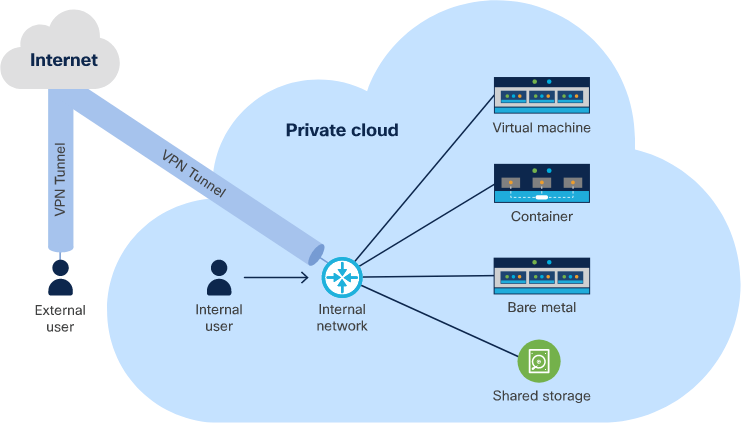
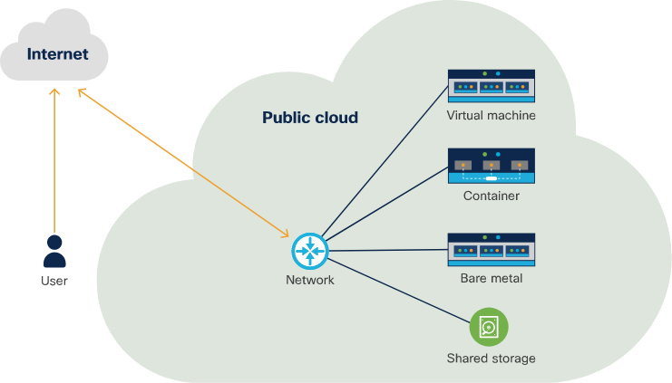
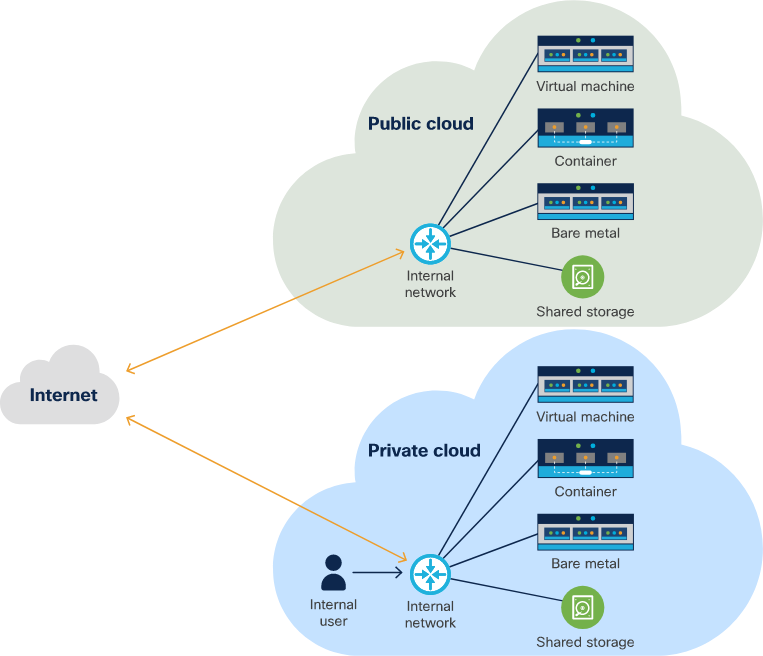
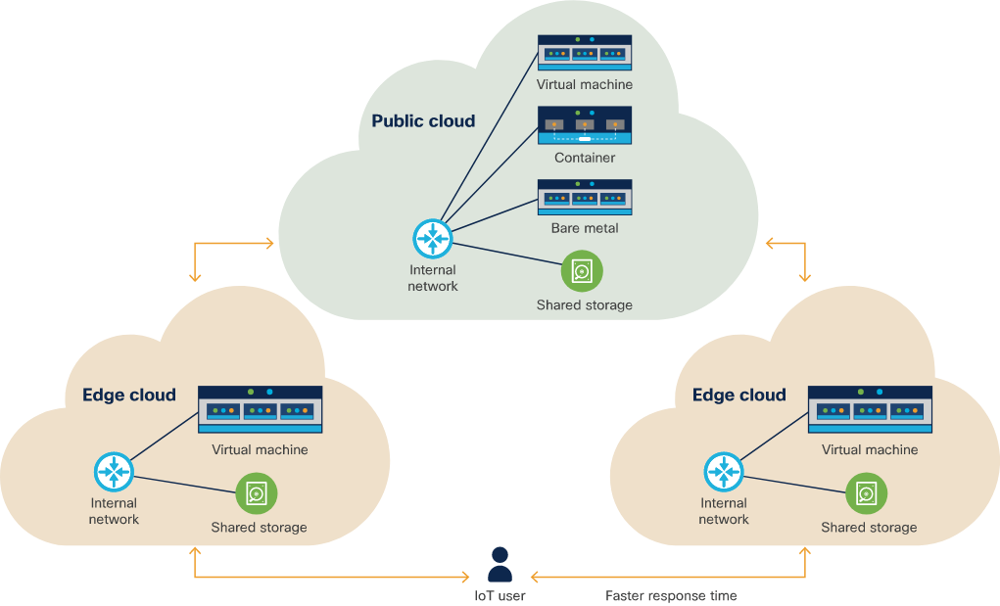

<!-- cSpell:ignore datacentre, CAPEX, OPEX, bursty,-->

# Attributes of different application deployment models

## Private cloud

* A cloud under control of your organization
* Typically deployed in a datacentre
* You control where it's located, how it runs and what is running on it
    * Handy if you need to meet certain compliance
* Requires a team of operations engineers to maintain the private cloud
* Typically high CAPEX and OPEX

## Public cloud

* Managed by a public cloud provider such as AWS or Azure
* Infrastructure is deployed in regions, closer to your clients for lower latency and better performance
    * Typically this makes it easier to get geographical diversity and resilience
* Very low and often negligible CAPEX costs, high OPEX
* Don't pay for hardware you don't use
* You will be sharing hosts with other customers, which may mean, due to over-committing you see performance issues

## Hybrid cloud

* Combination of both private and public cloud
* Public cloud can be used for it's advantages - if it's a bursty application type, then putting it here is ideal as it can scale
* Private cloud can be used to adhere to certain compliance issues

## Edge cloud

* Deploy services as close to the customer as possible, at the edge
    * Huge speed and bandwidth benefits
* One or more central cloud which is the hub for the edge clouds
* Cisco routers can run containers for this purpose!
* As they are essentially smaller public or private cloud, there's often resources restraints here

