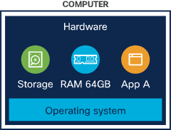
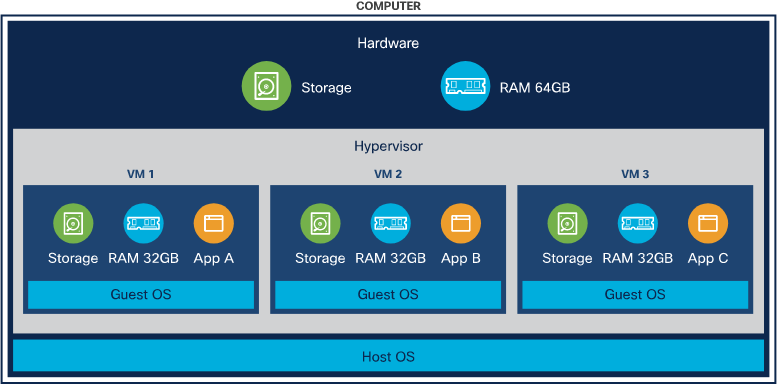
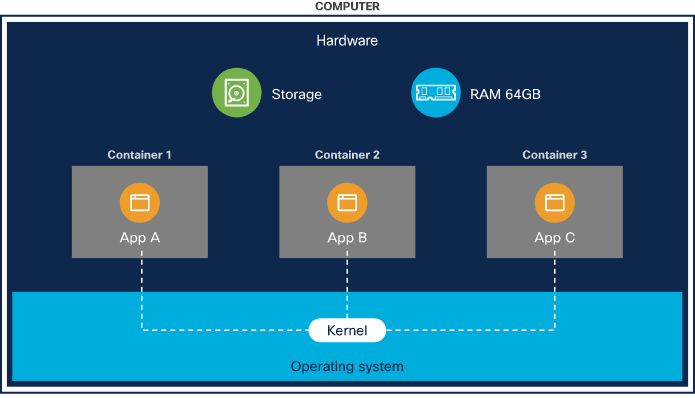
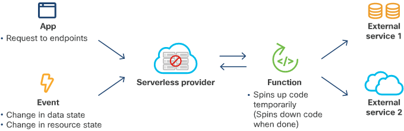

<!-- cSpell:ignore QEMU, -->

# Identify attributes of virtual machines, bare metal and containers

## Bare metal

* Software can access hardware and OS directly
    * Useful when you need special hardware for high performance computing (HPC)
* It's difficult to isolate workloads from one another (everything it using the same kernel)
* Hard to shrink/grow based on requirements
* Typically used to host virtualization frameworks (ESXi) or cloud frameworks

## Virtual machines (VMs)

* A machine running within a server or computer, with it's own computing power, network interfaces are storage
* Each VM is isolated from one another, with it's own kernel 
* VMs can run whatever OS you desire by using 'guest operating systems'
* You can over-commit your RAM/CPU etc which is more cost affective
* VMs run on a hypervisor (KVM, VMware, QEMU)

## Containers

* Designed to start up quickly, as no underlying software is needed.
* Managed by Docker, AWS ECS or Azure CS
* Contain libraries and binaries you need to run the application
* Each application is it's own contain, with it's own isolated libraries and binaries
* Only get charged when the application is running
    * If it's hit multiple times, it can expand east/west

### Serverless (kind-of sort-of)

1. Create application
2. Deploy application as container
3. Deploy to container serverless computing provider - contains a function of how long container should remain if inactive, before spun down
4. Application calls function
5. Provider spins up container, performs task, returns result

