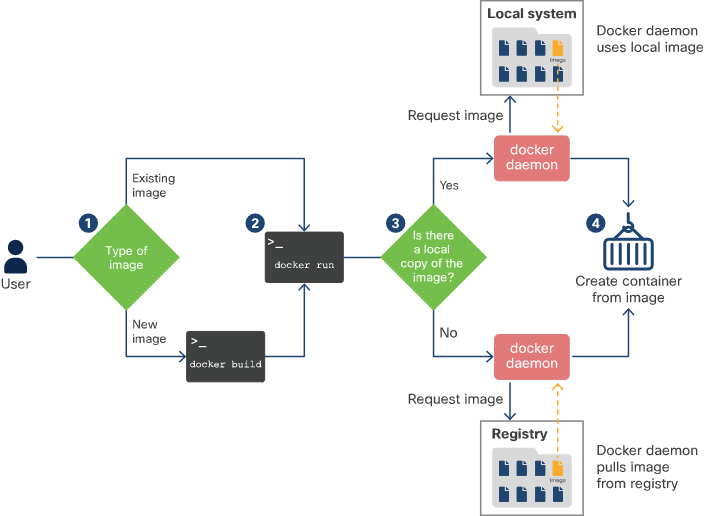

<!-- cSpell:ignore  pytest,-->

# Interpret the contents of a Docker file

## What is Docker?

* Containerize an application using Docker
* Wraps up the below in a container
    * Namespaces
        * Isolate different parts running inside the container
    * Control groups
        * Linux construct to limit resources (RAM etc)
    * Union File Systems
        * UnionFS built layer-by-layer, combining resources

## Interpreting a Docker file

* A *Dockerfile* must be created which can have various variables in, however you can use it to automatically download an image for your container